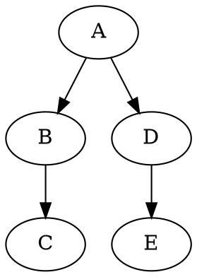

# Graphviz DOT Viewer

A lightweight web-based viewer for `.dot` files rendered with [d3-graphviz](https://github.com/magjac/d3-graphviz). Supports interactive visualization of dependency graphs, including hover-based highlighting of upstream and downstream nodes and edges.

## ✨ Features

- 📄 Upload and render `.dot`/Graphviz files
- 🧽 Highlight all ancestors and dependents on hover
- 🍗 Dim unrelated nodes and edges for clarity
- 🏹 Includes arrows, labels, and full SVG scaling
- 💅 Built with TailwindCSS, D3, and Vite

## 🚀 Usage

1. **Clone the repo**:

   ```bash
   git clone https://github.com/yourusername/graphviz-dot-viewer.git
   cd graphviz-dot-viewer
   ```

2. **Install dependencies**:

   ```bash
   npm install
   ```

3. **Start the dev server**:

   ```bash
   npm run dev
   ```

4. **Upload a `.dot` file** in the browser to see it rendered interactively.

## 📁 File Structure

```
.
├── index.html              # Viewer UI + layout
├── src/
│   ├── main.ts             # Core logic: parsing, rendering, event binding
│   └── style.css           # Tailwind styles and highlight classes
├── vite.config.ts          # Vite + Tailwind setup
└── package.json
```

## 🧐 How It Works

- Parses the DOT source to extract a graph structure (adjacency list)
- Renders the graph to SVG using `d3-graphviz`
- Binds `mouseenter` / `mouseleave` listeners to each node
- Traverses both upstream and downstream from the hovered node
- Applies `.highlight` and `.dimmed` classes to nodes and edges accordingly

## 🎨 Customization

### Highlight Colors

Modify these classes in `style.css` to update highlight/dim behavior:

```css
g.node.highlight,
g.edge.highlight path,
g.edge.highlight polygon,
g.edge.highlight text {
  stroke: #38bdf8;
  fill: #38bdf8;
  opacity: 1;
}

g.node.dimmed,
g.edge.dimmed path,
g.edge.dimmed polygon,
g.edge.dimmed text {
  opacity: 0.2;
}
```

### Graph Traversal

Both upstream (reverse dependencies) and downstream (children) are shown by default. You can adapt `collectRelatedNodesBothWays()` in `main.ts` to filter one direction only.

## 📄 Example `.dot` File



## 🛠️ Built With

- [D3-Graphviz](https://github.com/magjac/d3-graphviz)
- [D3.js](https://d3js.org)
- [Tailwind CSS](https://tailwindcss.com)
- [Vite](https://vitejs.dev)
- TypeScript

## 📘 License

MIT
